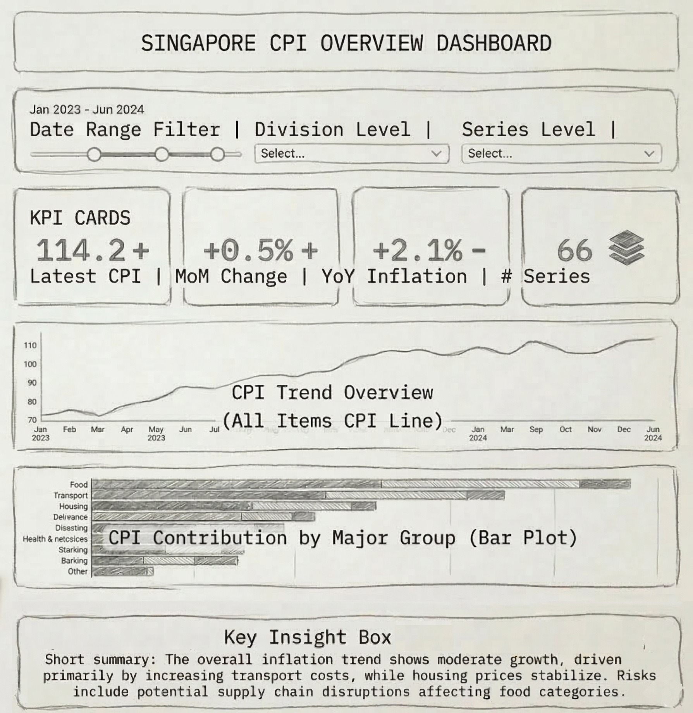
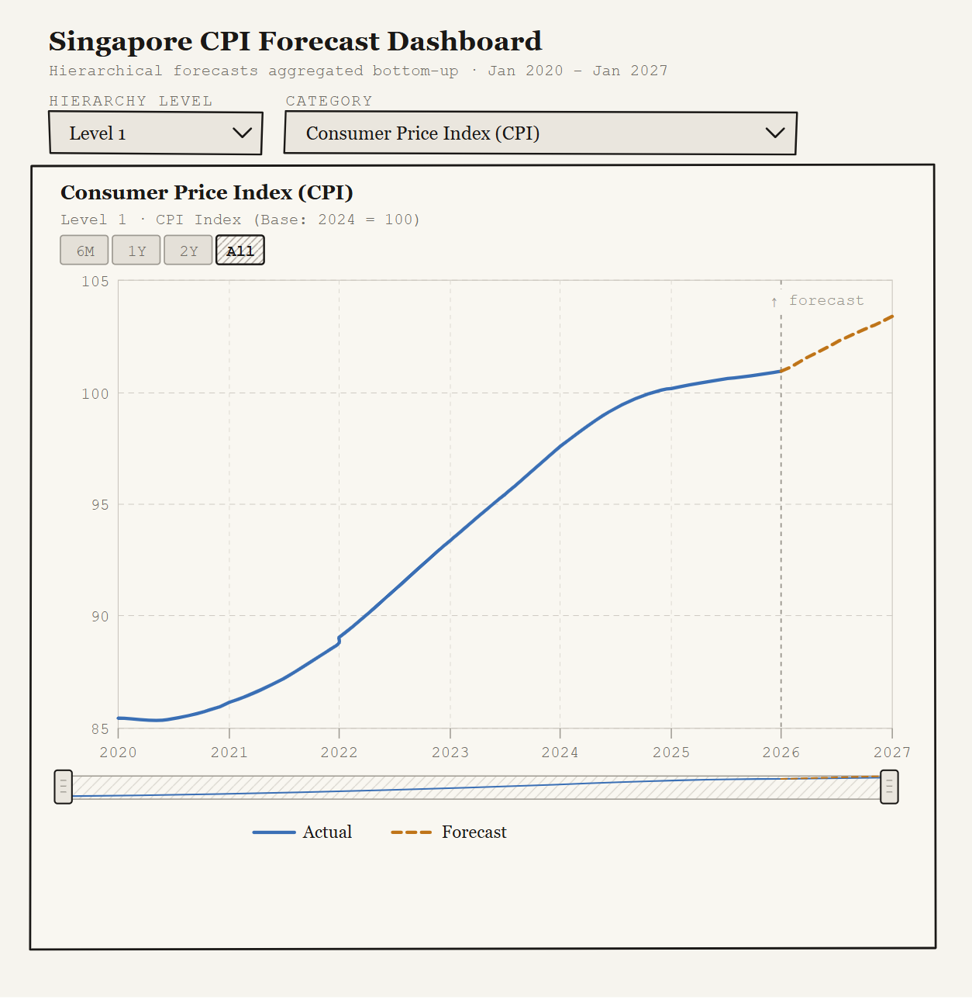

## Overview and Objectives {#overview}

### What is CPI?

**Consumer Price Index (CPI)**  is a widely used economic indicator that measures inflation by tracking changes in the price level of a basket of goods and services consumed by households. CPI provides an important reference for economic policy, wage adjustments, and cost of living assessments. In Singapore, CPI statistics are compiled and published by the Singapore Department of Statistics and are structured into 10 expenditure categories such as food, housing, transport, healthcare, and recreation.

The CPI dataset naturally forms a hierarchical structure, where detailed consumption items aggregate into broader categories and ultimately contribute to the overall inflation index. For example, individual items such as rice, meat, and vegetables belong to lower level sub categories, which aggregate into food related groups and eventually into the overall CPI.

### Why CPI?

Inflation directly affects the purchasing power of households, cost of doing business, and calibration of monetary policies. For an economy like Singapore, where natural resources are a scarcity, price levels are sensitive to the global commodities cycle, exchange rates, and disruptions in supply chain activities.

**For households:** The rise in inflation erodes purchasing power, making the price of everyday essentials such as food, transport, and utilities more expensive. CPI forecasts help households plan ahead — adjusting monthly budgets, timing big-ticket purchases, and planning savings and investments.

**For businesses:** Pricing strategies and cost planning are tightly related to expected inflation of direct materials. Access to reliable CPI forecasts allows businesses to anticipate pressures in the cost of doing business tied to inflation.

**For policy makers:** Unlike central banks in most countries, monetary policy managed by the Monetary Authority of Singapore (MAS) is centered on managing the Singapore Dollar against a trade-weighted basket of currencies (S\$NEER). A stronger S\$NEER makes imports cheaper, directly dampening consumer prices. CPI forecasts therefore complement policy-making by helping assess whether inflationary pressures are temporary or structural.

### Project Objective

::: {.callout-note icon="false"}
**Objective:** To evaluate and compare ETS, ARIMA, Auto-ARIMA + XGBoost, and Prophet time-series models and to deploy the best-performing model for each CPI index in an interactive R Shiny application.
:::

### Scope of Analysis
This study examines monthly Singapore CPI data from January 2020 to December 2025, covering multiple CPI categories from the overall index to detailed expenditure components (Base Year: 2024 = 100), sourced from the CEIC database via SMU Library.

The chosen period captures a particularly turbulent inflation cycle. Beginning just before the COVID-19 pandemic, the dataset spans the Circuit Breaker disruption of 2020, the global supply chain constraints and demand surge of 2021–2022, and the subsequent disinflation into 2024–2025. This offers a basis for studying how inflation dynamics evolved across different expenditure categories under rapidly shifting economic conditions.

By combining exploratory visualisation, time series decomposition, and forecasting, this study aims to characterise the behaviour of inflation across CPI components and generate near-term forecasts for future price movements.

---

## Data {#data}

### Data Source

The dataset is obtained from the **CEIC Database**, accessible via the SMU Library. It contains monthly Singapore CPI data with base year 2024, spanning from January 1961 to January 2026, last updated on 23 February 2026. For this project, the analysis period is restricted to **January 2020 – January 2025** to focus on the post-pandemic inflation dynamics. 

Since this project focuses on time series analysis, the original CPI dataset in wide format was transformed into a long format to make it suitable for time series modelling and analysis.

### CPI Hierarchy

The dataset preserves the full hierarchical structure of the official Singapore CPI classification published by the **Department of Statistics (DOS)**. The hierarchy spans four levels:

| Level | Description                    | Example                        |
|-------|--------------------------------|--------------------------------|
| 0     | Top Level (Overall Index)      | Consumer Price Index (CPI)     |
| 1     | Major Group                    | Food, Transport, Health        |
| 2     | Sub-Category                   | Food Excl FBSS, Accommodation  |
| 3     | Detailed Class (Leaf Node)     | Rice & Cereals, Fast Food      |

### CPI Basket Weights

Forecasts are reconciled using official expenditure weights from the [Singapore Consumer Price Index, Jan 2026](resources/cpijan26.pdf). The ten major groups and their weights (out of 10,000) are:

| Major Group                          | Weight |
|--------------------------------------|--------|
| Food                                 | 2,042  |
| Housing & Utilities                  | 2,938  |
| Transport                            | 1,307  |
| Health                               | 1,008  |
| Education                            | 579    |
| Recreation, Sport & Culture          | 595    |
| Household Durables & Services        | 547    |
| Miscellaneous Goods & Services       | 438    |
| Information & Communication          | 381    |
| Clothing & Footwear                  | 165    |

---

## Methodology {#methodology}

The analytical workflow consists of three stages executed in sequence: Data Preparation and EDA, Time Series Decomposition, and Time Series Forecasting. Each stage is described in its own subsection below.

### Data Preparation and EDA {#methodology-eda}

#### Data Wrangling

The data set was obtained from the **CEIC database via the SMU Library** and contains monthly Consumer Price Index (CPI) data from January 1961 to January 2026, with 2024 = 100 as the base year. The data was imported into R using `read_excel()` from the **readxl** package. The dataset was initially structured in a **wide format**, where rows represent dates and columns represent CPI categories and subcategories.

To focus on recent inflation dynamics, the dataset was filtered to include the period **January 2020 to December 2025** using `mutate()`, `as_date()`, and `filter()` from the **dplyr** and **lubridate** packages. The dataset was then reshaped into a **tidy long format** using `pivot_longer()` from **tidyr**, allowing each CPI category to be treated as an individual time series.

Given the hierarchical structure of CPI categories, labels were generated using `mutate()` and `str_detect()` from the **stringr** package to distinguish between different levels of CPI aggregation. Column names containing long hierarchical strings were also standardised using functions from **stringr** and **dplyr** to improve readability. Data integrity checks were performed using `sum(is.na())` to ensure that no missing values or misaligned entries were present. The cleaned dataset was then saved using `write_rds()` for reproducibility. An interactive data table was also created using the **DT** package to enable sorting, filtering, pagination, and export options.

#### Exploratory Data Analysis

Exploratory data analysis was conducted to understand the **trend, seasonality, and temporal dependence** of CPI series. Trend patterns are visualised using `plot_time_series()` from the **timetk** package and **ggplot2** for customised plotting. Seasonal behaviour was examined using `plot_seasonal_diagnostics()` from **timetk** to detect monthly/quarterly/ yearly patterns. Temporal dependence was further analysed using `plot_acf_diagnostics()` to generate **ACF, PACF, and CCF plots**, which help assess lag relationships and inform time series modelling.

To support **Shiny dashboard development**, reusable wrapper functions were created for each EDA component. These functions expose key parameters, allowing flexible selection of CPI series, hierarchical levels, and visualisation options. This design improves interactivity, reproducibility, and scalability when exploring CPI dynamics across categories.

---

### Time Series Decomposition {#methodology-decomposition}

#### STL Decomposition

Seasonal and Trend decomposition using Loess (**STL**) is applied to each CPI series. STL is widely used for economic time series because it is robust to outliers and flexible enough to handle changing seasonal patterns. This is particularly relevant for Singapore CPI data, which experienced structural disruptions during the COVID-19 pandemic and the subsequent inflation cycle.

Each CPI variable is converted into a monthly time series beginning in **January 2020**, with a frequency of **12 observations per year**. The STL algorithm then decomposes the series into **trend**, **seasonal**, and **remainder** components using locally weighted regression (Loess). This approach allows the seasonal component to evolve gradually over time rather than assuming a fixed seasonal structure.

#### Observed Series Summary

To provide an overview of the observed CPI series, summary statistics are computed for each CPI category. These include the **starting value in January 2020**, the **ending value in December 2025**, the **absolute increase**, and the **percentage change** over the study period. These summary measures provide a quick comparison of inflation dynamics across different CPI components.

#### Decomposition Interpretation

The magnitude of each component (trend, seasonal, and remainder) is quantified and normalised by the mean of the corresponding CPI series. This normalisation allows the relative importance of each component to be compared across different CPI categories. Series with a dominant trend component indicate persistent inflation movements, while stronger seasonal components suggest regular cyclical price behaviour. Larger remainder components may indicate irregular shocks or volatility not explained by structural patterns.

---

### Time Series Forecasting {#methodology-forecasting}

Four forecasting approaches are implemented and benchmarked using the **modeltime** framework in R. All models are trained on data prior to February 2025 and evaluated on a held-out test set of 12 months using a nested forecasting scheme. The best-performing model for each CPI series is selected based on the lowest RMSE and refitted on the full dataset before generating future forecasts.

#### Model Suite

| Model                  | Type                | Key Strength                                                        |
|------------------------|---------------------|---------------------------------------------------------------------|
| ETS                    | Classical           | Captures trend and seasonality via exponential smoothing            |
| Auto-ARIMA             | Classical           | Automated order selection for optimal fit on stationary series      |
| Auto-ARIMA + XGBoost   | Hybrid              | Combines Auto-ARIMA with XGBoost to capture non-linear residuals    |
| Prophet                | Additive Regression | Robust to missing data and handles seasonal shifts flexibly         |

#### Hierarchical Forecasting

Forecasts are generated at the most granular level (leaf nodes) and aggregated upward using a **bottom-up reconciliation** approach. Each leaf node forecast is weighted according to its official CPI basket weight, and parent-level indices are derived as weighted averages of their child components.

#### Evaluation

Models are compared using RMSE, MAE, and MASE. The best-performing model per series is identified by the lowest RMSE on the 12-month hold-out test set, refitted on the full dataset, and used to generate forward-looking forecasts.

---

## Prototype {#prototype}

The following wireframes illustrate the planned layout of the R Shiny application.

### Landing Page

### EDA Page

### Data Table

### Forecasting Page

---

## Minutes of Meeting {#minutes}

### Meeting 1 — Project Kickoff

*Date: 2 March 2026 · Attendees: All group members*

The team aligned on the project scope to forecast Singapore CPI and the level of granularity using CEIC data. Initial task allocation was agreed upon: Exploratory Data Analysis, ACF, and PACF analysis (Yiqiong), Time Series Decomposition (Jangho), Forecasting (Kevin). [View minutes →](minutes/Meeting%20Minutes%201.pdf)

### Meeting 2 — Progress Discussion

*Date: 11 March 2026 · Attendees: All group members*

Each team member presented updates based on the tasks assigned in the previous meeting. [View minutes →](minutes/Meeting%20Minutes%202.pdf)

### Meeting 3 — TBD

*Date: TBD · Attendees: All group members*

Topic TBD. [View minutes →]()

## Project Timeline and Work Allocation {#timeline}

The project is divided into several stages covering data preparation, exploratory analysis, time series modelling, and application development. Tasks are distributed among team members according to their assigned analytical modules.

### Work Allocation

| Task | Team Member |
|---|---|
Data Preparation & Exploratory Data Analysis | Pan Yiqiong |
Time Series Decomposition | Lee Jangho |
Time Series Forecasting | Kevin A. Suyapto |
Shiny Application Development | All Members |
Final Report & Presentation | All Members |

### Project Timeline

| Task | Week 1 | Week 2 | Week 3 | Week 4 |
|---|---|---|---|---|
Project Setup & Data Collection | █ | | | |
Exploratory Data Analysis | █ | █ | | |
Time Series Decomposition | | █ | | |
Forecasting Model Development | | | █ | |
Shiny App Development | | | █ | █ |
Final Report & Presentation | | | | █ |
